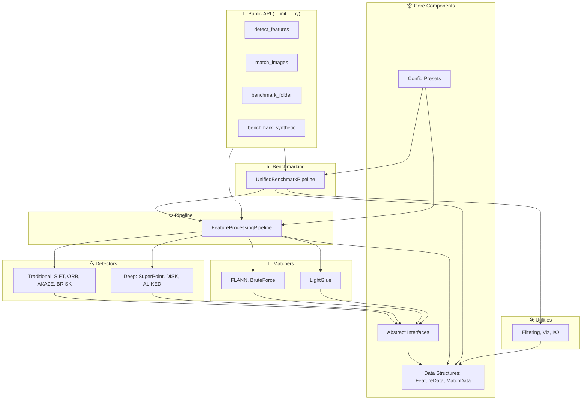

# 🔍 Multi-Method Feature Detection & Matching System

A **comprehensive computer vision library** for feature detection and matching that unifies **traditional** and **deep learning** approaches with a robust **benchmarking pipeline**.

<p align="center">
  
</p>

---

## 📌 Quick Links

* [Features](#-features)
* [System Architecture](#-system-architecture)
* [Installation](#-installation)
* [Quick Start](#-quick-start)
* [Advanced Usage](#-advanced-usage)
* [Benchmarking](#-benchmarking)
* [Use Cases](#-use-cases)
* [API Reference](#-api-reference)
* [Performance Expectations](#-performance-expectations)
* [Contributing](#-contributing)
* [Roadmap](#-roadmap)

---

## 🚀 Features

* **Multi-Method Detection**

  * 🧭 Traditional: `SIFT`, `ORB`, `AKAZE`, `BRISK`, `Harris`, `GoodFeaturesToTrack`
  * 🤖 Deep Learning: `SuperPoint`, `DISK`, `ALIKED`

* **Flexible Matching**

  * 🔗 Traditional: `FLANN`, `BruteForce + ratio test`
  * ⚡ Deep Learning: `LightGlue` (end-to-end)

* **Intelligent Selection**: Auto-choose matchers based on descriptor type

* **Multi-Score Support**: Distance, confidence, similarity

* **Benchmarking Pipeline**:

  * Unified performance & accuracy evaluation
  * Confidence intervals & significance testing
  * Memory profiling & synthetic image generation

* **Comprehensive Reports**:

  * JSON, CSV, Pickle export
  * Interactive visualizations (histograms, reprojection error, inlier ratios)

---

## 🏗️ System Architecture



---

## ⚡ Installation

### Basic (traditional methods only)

```bash
pip install opencv-python numpy matplotlib pandas psutil
```

### With Deep Learning Support (recommended)

```bash
# Install PyTorch first (see https://pytorch.org for instructions)
pip install torch torchvision
```

### Development Installation

```bash
git clone https://github.com/your-org/feature-detection-system.git
cd feature-detection-system
pip install -e .[dev]
```

---

## 🔥 Quick Start

### 1. Detect Features

```python
import cv2, feature_detection_system as fds

img = cv2.imread("image.jpg")
img = cv2.cvtColor(img, cv2.COLOR_BGR2RGB)

features = fds.detect_features(img, "SIFT")
print(f"Detected {len(features)} keypoints")
```

### 2. Match Images

```python
result = fds.match_images(img1, img2, methods=["SIFT", "ORB"])
print(f"Matches found: {len(result['match_data'].get_best_matches())}")
```

### 3. Benchmark

```python
results = fds.benchmark_folder(
    folder_path="images/",
    methods=["SIFT", "ORB", "AKAZE"],
    max_images=10,
    resize_to=(640, 480)
)
```

---

## 🔬 Advanced Usage

### Custom Pipeline

```python
from feature_detection_system import FeatureProcessingPipeline

config = {
  'methods': ['SIFT', 'ORB', 'lightglue'],
  'max_features': 2000,
  'combine_strategy': 'independent',
  'detector_params': {
    'SIFT': {'contrast_threshold': 0.04},
    'ORB': {'scale_factor': 1.2, 'n_levels': 8}
  }
}

pipeline = FeatureProcessingPipeline(config)
result = pipeline.process_image_pair(img1, img2, visualize=True)
```

### Comprehensive Benchmark

```python
from feature_detection_system.benchmark_pipeline import (
  UnifiedBenchmarkPipeline, UnifiedBenchmarkConfig, BenchmarkType)

config = UnifiedBenchmarkConfig(
  methods=['SIFT', 'ORB', 'AKAZE', 'lightglue'],
  benchmark_types=[BenchmarkType.PERFORMANCE, BenchmarkType.ACCURACY],
  max_images=15,
  resize_to=(640, 480),
  num_runs=3,
  save_results=True,
  output_dir='benchmark_results'
)

pipeline = UnifiedBenchmarkPipeline(config)
results = pipeline.benchmark_folder('/path/to/images')
pipeline.print_summary(results)
```

---

## 🎯 Use Cases

* **Image Registration**: Estimate homography, align images
* **Panorama Stitching**: Match consecutive frames
* **Object Recognition**: Query against feature databases
* **Method Comparison**: Benchmark traditional vs deep learning detectors

---

## 📊 Benchmarking

* **Performance**: FPS, matches per second, memory profiling
* **Accuracy**: Inlier ratios, reprojection error, geometric consistency
* **Synthetic Transformations**: Rotation, affine, perspective, scale

Results exportable to **JSON, CSV, Pickle** with visualizations.

---

## 📖 API Reference

* `detect_features(image, method='SIFT')`
* `match_images(img1, img2, methods=['SIFT'])`
* `benchmark_folder(folder_path, methods=None, ...)`
* `benchmark_single_image(image_path, methods=None, ...)`
* `benchmark_synthetic(methods=None, ...)`

---

## 🤝 Contributing

1. Fork repo & create a feature branch
2. Commit changes with clear messages
3. Push and open a Pull Request

---

## 🗺️ Roadmap

* **v0.0 (Current)**:

  * Unified pipeline for traditional + deep detectors
  * LightGlue matcher integration
  * Synthetic benchmarking support
  * Memory profiling utilities

* **v0.1 (Planned)**:

  * Memory leakage resolution when a lot of images are used
  * Additional matchers: LoFTR, ASpanFormer
  * Complete integration in a 3D reconstruction pipeline
  * Web interface for benchmarking

---

## 📄 License

MIT License — see [LICENSE](LICENSE)

---

