# 🏗️ Multi-Method Feature Detection & 3D Reconstruction Pipeline

A **research-grade computer vision framework** that unifies **feature detection**, **matching**, and **3D reconstruction** with strong support for **benchmarking, reproducibility, and extensibility**.

<p align="center">
  
</p>

---

## ✨ Highlights

* **Feature Detection & Description**

  * 🧭 Traditional: SIFT, ORB, AKAZE, BRISK, Harris, Good Features to Track
  * 🤖 Deep Learning: SuperPoint, DISK, ALIKED
* **Feature Matching**

  * Traditional: FLANN, Brute-Force + ratio test
  * Deep: LightGlue (end-to-end)
* **3D Reconstruction Integration**

  * Two-view geometry (fundamental/essential matrix)
  * Bundle adjustment (planned full pipeline integration)
* **Benchmarking & Analysis**

  * Statistical evaluation across detectors and matchers
  * Memory profiling, synthetic datasets, reproducibility utilities
* **Output & Visualization**

  * JSON, CSV, pickle exports
  * Matching visualizations, inlier ratios, reprojection errors

---

## 📂 System Architecture

```mermaid
graph TB
  subgraph API["🎯 Public API"]
    API1[detect_features]
    API2[match_images]
    API3[benchmark_folder]
    API4[reconstruct_scene]
  end

  subgraph Core["📦 Core Components"]
    DATA[Data Structures: FeatureData, MatchData, Camera]
    BASE[Abstract Interfaces]
    CONFIG[Config Presets]
  end

  subgraph Detectors["🔍 Detectors"]
    TRAD[Traditional]
    DEEP[Deep]
  end

  subgraph Matchers["🔗 Matchers"]
    TMATCH[FLANN, BruteForce]
    DMATCH[LightGlue]
  end

  subgraph Reconstruction["🏗️ 3D Reconstruction"]
    GEOM[Epipolar Geometry]
    BA[Bundle Adjustment]
  end

  subgraph Benchmark["📊 Benchmarking"]
    BENCH[Unified Benchmark Pipeline]
  end

  subgraph Utils["🛠️ Utilities"]
    UTIL[Filtering, Visualization, I/O]
  end

  API --> TRAD
  API --> DEEP
  API --> TMATCH
  API --> DMATCH
  API --> GEOM
  API --> BENCH

  GEOM --> BA
  BENCH --> UTIL
  BENCH --> DATA
  BA --> DATA
  TRAD --> BASE
  DEEP --> BASE
  TMATCH --> BASE
  DMATCH --> BASE

  BASE --> DATA
  CONFIG --> BENCH
  CONFIG --> BA
```



---

## ⚡ Installation

### Basic (traditional only)

```bash
pip install opencv-python numpy matplotlib pandas psutil
```

### With Deep Learning Support

1. [Install PyTorch](https://pytorch.org/get-started/locally/)
2. Then:

```bash
pip install torch torchvision
```

### Development Mode

```bash
git clone https://github.com/your-org/3DReconstructionPipeline.git
cd 3DReconstructionPipeline
pip install -e .[dev]
```

---

## 🚀 Quick Start

### 1. Detect Features

```python
import cv2, pipeline as pl

img = cv2.imread("image.jpg")
img = cv2.cvtColor(img, cv2.COLOR_BGR2RGB)
features = pl.detect_features(img, "SIFT")
print(f"Detected {len(features)} keypoints")
```

### 2. Match Images

```python
result = pl.match_images(img1, img2, methods=["SIFT", "ORB"])
print("Matches:", len(result['match_data'].get_best_matches()))
```

### 3. Reconstruct 3D Scene

```python
scene = pl.reconstruct_scene(img1, img2, method="SIFT")
scene.visualize_point_cloud()
```

### 4. Benchmarking

```python
results = pl.benchmark_folder(
    folder_path="./images/",
    methods=["SIFT", "ORB", "AKAZE"],
    max_images=10
)
```

---

## 🧪 Testing

Run the full test suite:

```bash
pytest tests/
```

---

## 📌 Roadmap

### **v1.0 (Current)**

* Unified detection & matching (traditional + deep)
* LightGlue matcher support
* Two-view reconstruction components
* Benchmarking utilities

### **v1.1 (Planned)**

* Memory leakage resolution on large datasets
* New matchers: LoFTR, ASpanFormer
* Full 3D reconstruction pipeline integration
* Web interface for benchmarking & visualization

---

## 🤝 Contributing

We welcome contributions! Please:

* Fork the repo & create feature branches
* Add/extend tests (`pytest`)
* Submit a pull request with a clear description

---

## 📜 License

This project is released under the MIT License.

---
